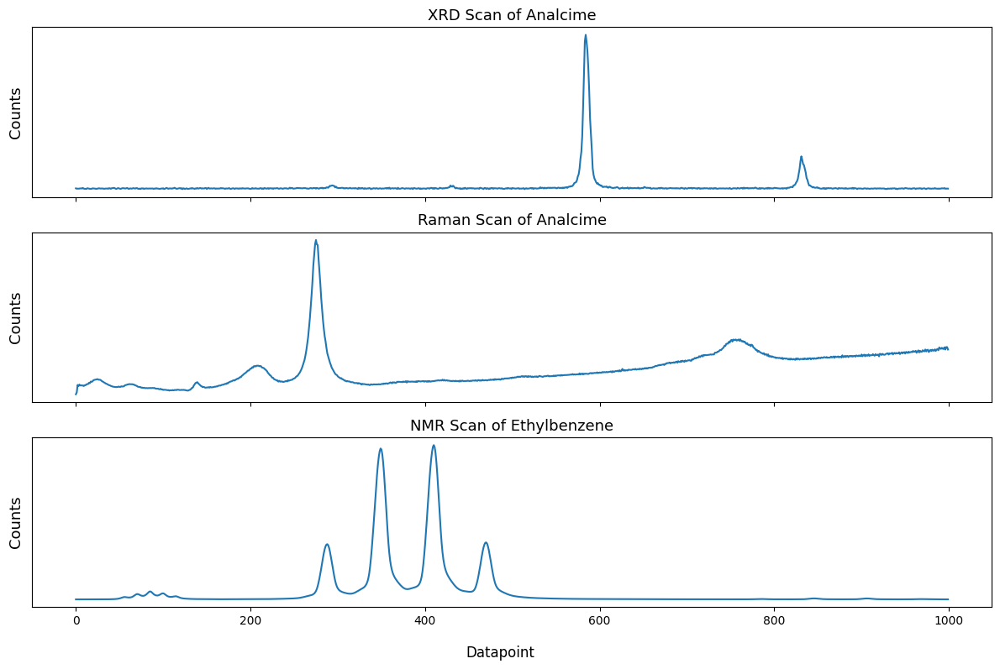
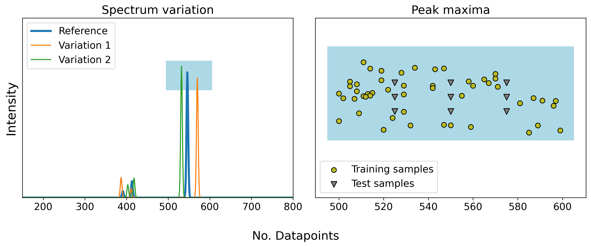

# Validating neural networks for spectroscopic classification on a universal synthetic dataset
To aid the development of machine learning models for automated spectroscopic data classification, we created a universal synthetic dataset for the validation of their performance.
The dataset mimics the characteristic appearance of experimental measurements from techniques such as X-ray diffraction, nuclear magnetic resonance, and Raman spectroscopy among others.
We applied eight neural network architectures to classify artificial spectra, evaluating their ability to handle common experimental artifacts. 
While all models achieved over 98\% accuracy on the synthetic dataset, misclassifications occurred when spectra had overlapping peaks or intensities. 
We found that non-linear activation functions, specifically ReLU in the fully-connected layers, were crucial for distinguishing between these classes, while adding more sophisticated components, such as residual blocks or normalization layers, provided no performance benefit.
Based on these findings, we summarize key design principles for neural networks in spectroscopic data classification and publicly share all scripts used in this study.

## Concept
Spectroscopic and diffraction signals are visually similar with characteristic intensity peaks when zoomed to matching segment lengths.



Correspondingly, a synthetic dataset is formed which incorporates the characteristics of the different signals. The dataset contains multiple unique classes with distinct patterns (number, position and height of peaks). To account for realistic artifacts, the ideal spectra information is varied and multiple samples are generated per class.



Then, multiple established neural network architectures are trained on the synthetic spectra and their performance and classification behavior is evaluated in detail.

## Replicating the benchmarks

The models are trained in a Docker container to ensure matching package versions. The images are available in the Github container registry for this repository. An [Weights & Biases](https://wandb.ai) Account is required to track the training and metrics. 

First, pull the relevant image(s):
```
docker pull ghcr.io/jschuetzke/synthetic-spectra-benchmark:benchmark
docker pull ghcr.io/jschuetzke/synthetic-spectra-benchmark:challenge-activation
docker pull ghcr.io/jschuetzke/synthetic-spectra-benchmark:challenge-modification
```

To run the benchmark, create a wandb project named **synthetic-benchmark** and copy your W&b API key. Replace the *YOURKEY123* placeholder in the following line with your personal key:
```
docker run --rm -e "WANDBKEY=YOURKEY123" ghcr.io/jschuetzke/synthetic-spectra-benchmark:VERSION
```

## Usage

This repository can be used to analyze the benchmark data and for the generation of further synthetic spectra datasets.

Clone the repository and install the required Python packages as defined in the requirements.txt file

```
git clone https://github.com/jschuetzke/synthetic-spectra-benchmark
cd synthetic-spectra-benchmark
pip install -r requirement.txt
```

## Generating new datasets

There are two relevant scripts for producing further synthetic spectra datasets to fit unique constraints:
1. Change the values in the [config_generator](./dataset_config_generator.py)
2. Modify the number of samples or degree of variation in the [spectra_from_config](./spectra_from_config.py) script


## External ressources

The exact training, validatio, and test samples for the general and challenge benchmark, as well as the weights of the trained models, are available here:
https://figshare.com/articles/dataset/Synthetic_spectra_challenging_dataset/22188433

Documentation of the training runs can be found here:
https://wandb.ai/jschuetzke/synthetic-benchmark/overview
